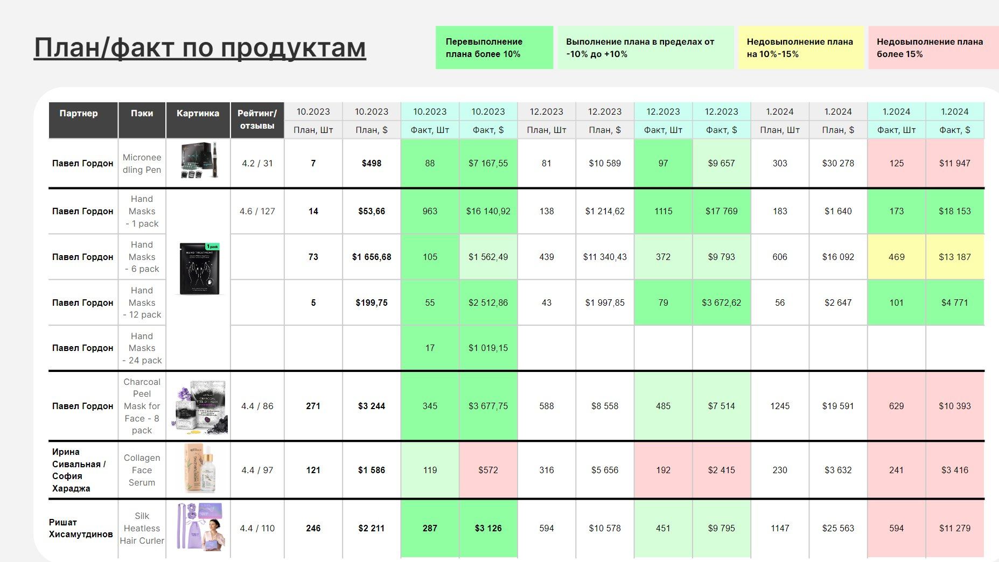

# Intial module requreents v1.0

Sales module for Odoo ERP system. It should include import Products, Variants, Sales Orders, Sales Plan Transactions. CSV files in data folder.

At first version it will import from csv. We create import task from source in later steps.

## Odoo requrements

version 17.0

## Entinties/Models

### Producs & Variants

This is product with related selling Packs.
Example:

Product **Hand Masks** has Hand Masks - 1 pack, Hand Masks - 6 pack, Hand Masks - 12 pack variant.Each variant has multiple ASIN(amazon id)


### Sales Order

Sales order contain: ASIN, number_of_items, amountUSD, orderID, date

### Sales Plan

Sales plan contain: pack, number_of_items, amountUSD, date(future), version

About version - right now we have two version of sales plan(initial and current).

## Report

Report should looks like example:

It in Russian language.

Translations:

```
План - Plan(sales projections);
Факт - Fact(real sales);
Партнер - Partner(owner)
Паки - Packs
Картинка - image
Рейтинг/Отзывы - Rating/Review
```

Colors logic:

```
If plan more than fact 15% - salmon red(#ffd5d5)
If plan is more than fact 10-15% - light yellow(#fdffae)
If fact more than plan 15% - lime green(#8ffea2)
If fact near plan -10%+10% - green(#d5ffd9)
```



## Other requirements

1. As a user I should have ability to change Sales Plan for each pack and future month.
2. As a user I should view all changes to each salas plan and user who is change(change history)
3. As a user I can add sales plan and plan version on some date (plan history)
